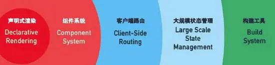

<!--
 * @Author: wayne
 * @Date: 2020-10-28 16:22:42
 * @LastEditTime: 2020-10-28 17:01:42
 * @LastEditors: Please set LastEditors
 * @Description: In User Settings Edit
 * @FilePath: \source-code\vue.md
-->

### 如何理解vue的渐进式？

提供足够的optional，但并不主张更多的required

> Vue.js（读音 /vjuː/，类似于 view） 是一套构建用户界面的渐进式框架。


> 声明式渲染 => 组件化应用 => 客户端路由 => 集中式状态管理 => 项目构建



#### 声明式渲染
```javascript
    // 引入vue
    <script src="https://cdn.jsdelivr.net/npm/vue/dist/vue.js"></script>
    // html
    <div id="app">
    {{ msg }}
    </div>
    // js
    <script>
        var app = new Vue({
        el: '#app',
        data: {
            msg: 'Hello Vue!'
        }
        })
    </script>
```
#### 组件化应用
可将上述每个声明式的文件当成一个组件，一个项目中可以有多个组件相互构成


#### 客户端路由

> 通过使用客户端路由的特性实现单页面应用

#### 集中式状态管理

> vue重vuex的概念

#### 项目构建

> 一般是在一个大型项目中由开发，打包，部署，上线流程

vue开发者关于渐进式的理解

> 在我看来，渐进式代表的含义是：主张最少。 
> 每个框架都不可避免会有自己的一些特点，从而会对使用者有一定的要求，这些要求就是主张，主张有强有弱，它的强势程度会影响在业务开发中的使用方式。
> 比如说，Angular，它两个版本都是强主张的，如果你用它，必须接受以下东西：
> -必须使用它的模块机制- 必须使用它的依赖注入- 必须使用它的特殊形式定义组件（这一点每个视图框架都有，难以避免）
> 所以Angular是带有比较强的排它性的，如果你的应用不是从头开始，而是要不断考虑是否跟其他东西集成，这些主张会带来一些困扰。
> 比如React，它也有一定程度的主张，它的主张主要是函数式编程的理念，比如说，你需要知道什么是副作用，什么是纯函数，如何隔离副作用。它的侵入性看似没有Angular那么强，主要因为它是软性侵入。
> Vue可能有些方面是不如React，不如Angular，但它是渐进的，没有强主张，你可以在原有大系统的上面，把一两个组件改用它实现，当jQuery用；也可以整个用它全家桶开发，当Angular用；还可以用它的视图，搭配你自己设计的整个下层用。你可以在底层数据逻辑的地方用OO和设计模式的那套理念，也可以函数式，都可以，它只是个轻量视图而已，只做了自己该做的事，没有做不该做的事，仅此而已。 
> 渐进式的含义，我的理解是：没有多做职责之外的事。

最后再看一遍这句话

> Vue.js（读音 /vjuː/，类似于 view） 是一套构建用户界面的渐进式框架。
